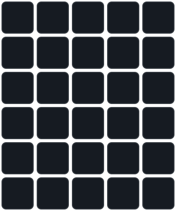

I’m an IT student and full-stack developer who enjoys designing systems as much as interfaces.

I map out how every part connects, then turn it into software that feels intuitive for users, efficient behind the scenes, and purposeful from end to end.

**[Explore my portfolio →](https://exzestentialcrisis-portfolio.vercel.app/)**

## `stack.config`

### // LANGUAGES

### // FRONTEND + MOBILE

### // BACKEND + APIS

### // DATABASES + SERVICES

### // DESIGN + DEVELOPMENT TOOLS

### // CURRENTLY EXPLORING

## `activity.log`

 
 

<strong>🐍 CONTRIBUTION SNAKE</strong> 
A tiny pink menace eating my GitHub contributions.

<picture>
  <source media="(prefers-color-scheme: dark)" srcset="https://raw.githubusercontent.com/exzestentialcrisis/exzestentialcrisis/output/github-snake-pink-dark.svg">
  <source media="(prefers-color-scheme: light)" srcset="https://raw.githubusercontent.com/exzestentialcrisis/exzestentialcrisis/output/github-snake-pink.svg">
  
</picture>

## `flashwordle.md`

### Guess today's 5-letter word.

<strong>Legend</strong> 

🩷 Correct letter, correct position 
💗 Correct letter, wrong position 
⬛ Not in the word

 

### [▶ Leave a Guess](https://github.com/exzestentialcrisis/exzestentialcrisis/issues/1)

The bot will reply when your guess has been processed. 
Once it replies, open the refreshed profile to see the updated board ✦

 

Powered by GitHub Issues, GitHub Actions, and an unreasonable commitment to putting Wordle in my profile.

Probably debugging something that worked five minutes ago.

